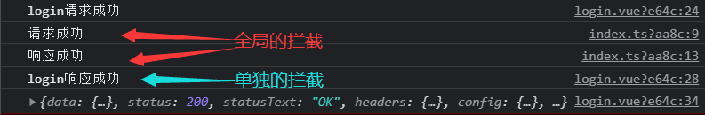

- ## axios封装：Typescript

### api参考：

1. createService ( )创建一个axios实例对象
   ```javascript
   import { createService } from "./request";
   import { BASE_URL, TIME_OUT } from "./request/configEnv";
   export const $http = createService({
   //创建的service的name
   //name属性为可选类型（默认名字为$http），创建实例的name 后续可用 useService 或者 reject 拿到name实例对象
   name: "service",
   //因环境变量不同而写入的不同的BASE_URL, TIME_OUT
   baseURL: BASE_URL,
   timeout: TIME_OUT,
   //定义当前实例的拦截器
   interceptors: {
    requestInterceptor: (config) => {
      console.log("请求成功");
      return config;
    },
    responseInterceptor: (config) => {
      console.log("响应成功");
      return config;
    },
    requestInterceptorCatch: (error) => {
      console.log(error);
    },
    responseInterceptorCatch: (error) => {
      console.log(error);
    }
   }
   });
   ```
   
   axios实例对象的name (默认均为 "$http")有l两种方式设置：
   ```javascript
   //方式一，在注册插件app.use（插件，name）
   app.use($http,'service');
   //方式二，createService传入的配置中设置name属性
   createService({
       name: "service",
   )}
   ```
   
   该实例对象已经封装了：{ GET POST DELETE PUT  PATCH }请求，
   
   如需添加新的请求方式如下：在request.ts文件下写入如下格式ts代码.
   ```javascript
   get<T>(config: CherryConfig): Promise<T> {
       return this.request<T>({ ...config, method: "GET" });
     }
   ```
   
   或者使用request  API
   ```javascript
   $http.request({
       url: "song/media/outer/url?id=33894312.mp3 ",
       method: "GET",
     })
   ```
   
   ***
2. useService（name:string）拿到axios实例—name
   ```javascript
   //拿到名为service的axios实例对象 默认不传为"$http" axios实例对象
   const service = useService("service");
   ```

***

	3.具体用法：

```javascript
import { defineComponent, inject } from "vue";
import { useService } from "../../service/request";
export default defineComponent({
  setup() {
    // 方式一 使用inject
    const $http = inject("service") as any;
    $http.get({
        url: "/search/hot/detail"
      }).then((res: any) => {
        console.log(res);
      });
      // 方式二 使用useService
    let service = useService("service");
    service?.get({
        // config配置
        url: "/search/default",
      })
      .then((res) => {
        console.log(res);
      });
```

4.封装的添加的特性

可以对单次的网络请求进行拦截

示例：

```javascript
    let service = useService("service");
    service?.get({
        // config配置
        url: "/search/default",
        //对此次的网络请求设置网路拦截器
        interceptors: {
          requestInterceptor: (config) => {
            console.log("login请求成功");
            return config;
          },
          responseInterceptor: (config) => {
            console.log("login响应成功");
            return config;
          }
        }
      })
      .then((res) => {
        console.log(res);
      });
```

效果：

